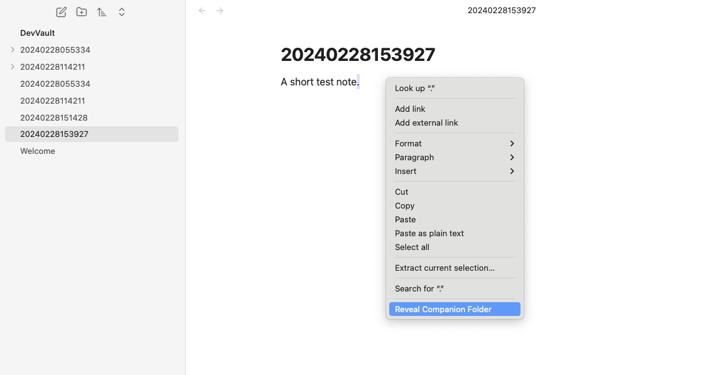
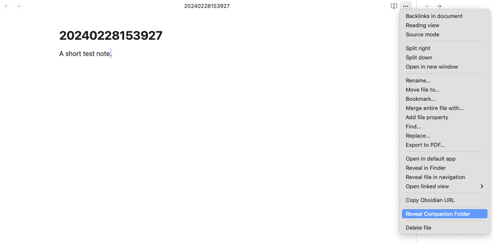
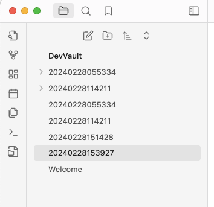
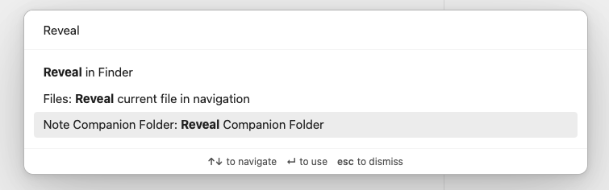

# Note Companion Folder Plugin

Manage a companion folder at the same location as the note with the same name minus the .md extension for notes in Obsidian.

This plugin provides a:

- Adds a Ribbon icon
- A command
- A context action
- A file action 

to reveal a companion folder for a given note.

If the companion folder does not exist it will be created.

## Install

You can find Buttons in the list of community plugins!